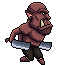

# Survival Rush

## Player's Guide 

### Controls
The player can move using the arrow keys and the WASD keys. 

Press the SPACE or ESC keys to pause/unpause the game.

### Rules
The game lasts as long as the health of the player lasts or they survive the time limit. 
With more time you survive, the enemies will become more stronger!

### Enemies
There are 4 types of enemies. 

Orc: 
Robot:
Berserk:  
MegaOrc: 

### Aura

There are several types of loots:

1. Exp Orb: Get Experience. 
2. Speed Crystal: Increases speed of moving and attacking for a short time. 
3. Attack Ctystal: Increases attack targets for a short time. 
5. Heart Stone: Heal your character. 

### Weapon

There are six type of weapons, each of them can be upgraded to a max level of 10:

1. Magic Wand: Shoot magic orbs through your direction. 
2. Spike Wand: Summon Spikes on the ground to continuously hurt enemies.
3. Fire Path: Summon fire paths to burn the enemies.
4. Aster Wand: Summon asters flying around you.
5. Shard Staff: Shoot shards in an extreme speed through your direction.
6. Boomrang: Throw boomrangs that can fly back to you.

### Cheat code

To test the full game functionalities in a convenient way, here is some cheat code for testing:

1. Press 'X' to add all weapons for your character.
2. Press 'Z' to upgrade all weapons for 1 level.
3. Press 'L' to level up your character
4. Press 'T' to move the game timer 1 minute forward.